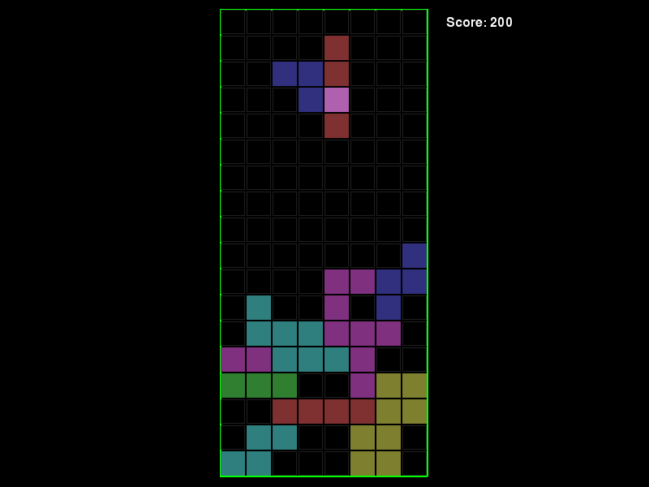

Confusetris
===========

A tetris implementation that confuses the hell out of you.

When a brick falls down, another brick shape is overlaid on top of it.  You
don't know which of the two shapes is the real one before it reaches the
bottom.

Dependencies
------------

* python2
* pygame
